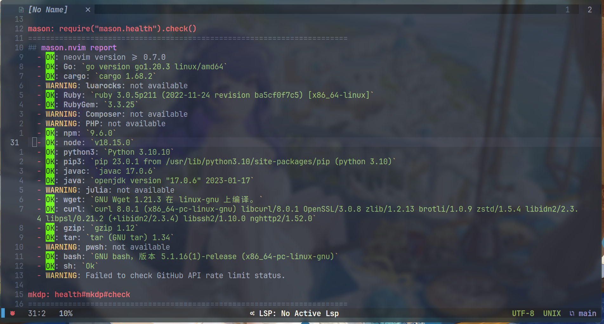
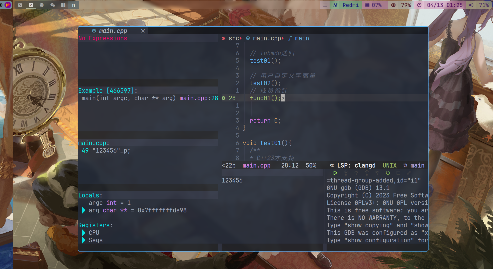

#  Neovim

## 环境
`:checkhealth` 检查环境
- neovim version >= 0.8 
- nodejs
- npm
- python
- pip3
-	gcc/clang
- cmake
- gdb
- xcilp 




### Arch Linux
```bash 
sudo pacman -S neovim python3 nodejs npm ripgrep fzf fd

pip3 install pynvim

sudo npm i neovim -g
# C++ 编译与调试
sudo pacman -S gcc cmake make gdb clang xclip 
:checkhealth -- 会进行基本环境的检查

```

### 字体

```shell 
# CJK
yay -S noto-fonts-cjk 
# hck
yay -S ttf-hack


```

## 按键表格
### 移动

| KEY  | Commit |
| :--: | :--:   |
| h    | 左移   |
| j    | 下移   |
| k    | 上移   |
| l    | 右移   |


### 文本快速选择
Plugin :
- [wildfire.vim](https://github.com/gcmt/wildfire.vim)
- [vim-surround](https://github.com/tpope/vim-surround)

| Command   | commit   |
| :-:       | :-       |
| `vv`      | 快速选择 |
| `<Enter>` | 增量选择 |


| Command | commit         |
| :-:     | :-             |
| `S"`    | 选中文本添加"" |
| `S'`    | 添加''         |

`cs+修改+目标`：`cs'"` 将'Text' 改为 "Text"

### C++ Code


| key          | translator |
| :--:         | :--:       |
| `<leader>ff` | 文件搜索   |
| `<leader>rf` | 文件搜索   |
| `<leader>fg` | 文本搜索   |
| `<leader>rl` | 文本搜索   |


| key          | translator   |
| :--:         | :--:         |
| `<leader>la` | 代码优化     |
| `<leader>ld` | 代码错误列表 |
| `<leader>lo` | 代码结构     |


### venn.nvim(画图)


- [venn.nvim](https://github.com/jbyuki/venn.nvim)
- Draw ASCII diagrams in Neovim.

`set virtualedit=all` or `set ve=all
`Enables/Disables `<leader>v`

| key  | translator         |
| :--: | :--:               |
| `f`  | 画框(ctrl + v选中) |
| `H`  | 左箭头             |
| `J`  | 上箭头             |
| `K`  | 下箭头             |
| `L`  | 右箭头             |


### 翻译

| KEY          | Translator |
| :--:         | :--:       |
| `<Leader>fy` | 窗口翻译   |
| `<Leader>r`  | 终端翻译   |


### [CMake-Tools](https://github.com/Civitasv/cmake-tools.nvim)

#### usage

| Command                    | Description                                                                                                                                                                                                                                                                                                  |
| :-:                        | :-                                                                                                                                                                                                                                                                                                           |
| CMakeGenerate[!]           | Generate native makefiles and workspaces that can be used next. Additional arguments will be passed to CMake. eg. Use CMakeGenerate -G MinGW\ Makefiles to specify another generator.                                                                                                                        |
| CMakeBuild                 | Build target, if not generate makefiles yet, it will automatically invoke CMake, if not select build target, it will automatically invoke CMakeSelectBuildTarget . Additional arguments will be passed to CMake.                                                                                             |
| CMakeRun                   | Run launch target, if not generate makefiles yet, it will automatically invoke CMakeGenerate, if not select launch target, it will automatically invoke CMakeSelectLaunchTarget, if not built, it will automatically invoke CMakeBuild. Additional arguments will be passed to CMakeGenerate and CMakeBuild. |
| CMakeDebug                 | Use nvim-dap to debug launch target, works like CMakeRun                                                                                                                                                                                                                                                     |
| CMakeSelectBuildType       | Select build type, include "Debug", "Release", "RelWithDebInfo", "MinSizeRel" for default. cmake-tools.nvim also support cmake variants, when "cmake-variants.yaml" or "cmake-variants.json" is provided, it will read configuration from it                                                                 |
| CMakeSelectBuildTarget     | Select build target, include executable and library targets                                                                                                                                                                                                                                                  |
| CMakeSelectLaunchTarget    | Select launch target, only include executable targets                                                                                                                                                                                                                                                        |
| CMakeSelectKit             | Select kit defined from CMakeKits.json                                                                                                                                                                                                                                                                       |
| CMakeSelectConfigurePreset | Select configure preset, if CMake[User]Presets.json is provided                                                                                                                                                                                                                                              |
| CMakeSelectBuildPreset     | Select build preset, if CMake[User]Presets.json is provided                                                                                                                                                                                                                                                  |
| CMakeOpen                  | Open CMake console                                                                                                                                                                                                                                                                                           |
| CMakeClose                 | Close CMake console                                                                                                                                                                                                                                                                                          |
| CMakeInstall               | Install CMake targets. Additional arguments will be passed to CMake.                                                                                                                                                                                                                                         |
| CMakeClean                 | Clean target                                                                                                                                                                                                                                                                                                 |
| CMakeStop                  | Stop CMake process                                                                                                                                                                                                                                                                                           |

#### 配置
```lua 
-- 编译生成文件夹名称 build_ + (Debug | ...)
-- cmake -S . -B build 
cmake_build_directory_prefix = "build_", 
-- cmake 参数 这个是vcpkg的参数
cmake_generate_options = { "-D", "CMAKE_TOOLCHAIN_FILE=/home/yysheep/workspace/vcpkg/scripts/buildsystems/vcpkg.cmake " }, 

```

## dap调试



| Command      | commit             |
| :-:          | :-                 |
| `<leader>ld` | 打开或关闭调试窗口 |
| `<leader>dw` | 打开或关闭输出窗口 |


| Command      | commit   |
| :-:          | :-       |
| `<leader>dd` | 断点     |
| `,i`         | 单步进入 |
| `,n`         | 单步步过 |
| `,r`         | 重新运行 |


## Latex
Neovim Plugs:
-	[Vimtex](https://github.com/lervag/vimtex)

file:
[latex.lua](https://github.com/ygsheep/nvim/lua/lsp/vimtex.lua) 

```lua 
-- PDF预览软件
let g:vimtex_view_method = 'zathura'

-- 编译中文需要 xelatex

let g:vimtex_compiler_method = 'latexmk'
let g:vimtex_compiler_latexmk_engines = {
\ '_'                : '-xelatex',
\ 'pdfdvi'           : '-pdfdvi',
\ 'pdfps'            : '-pdfps',
\ 'pdflatex'         : '-pdf',
\ 'luatex'           : '-lualatex',
\ 'lualatex'         : '-lualatex',
\ 'xelatex'          : '-xelatex',
\ 'context (pdftex)' : '-pdf -pdflatex=texexec',
\ 'context (luatex)' : '-pdf -pdflatex=context',
\ 'context (xetex)'  : '-pdf -pdflatex=''texexec --xtx''',
\}

let g:vimtex_compiler_latexrun_engines = {
\ '_'                : 'xelatex',
\ 'xelatex'          : 'xelatex',
\ 'pdflatex'         : 'pdflatex',
\ 'lualatex'         : 'lualatex',
\}

-- 定义 <localleader> 为 ,
let maplocalleader = ","

```

Default `<localleader>` is `,`

| LHS               | RHS                             | MODE~ |
| :-:               | :-:                             | :-:   |
| `<localleader>li` | `<plug>(vimtex-info)`           | `n`   |
| `<localleader>lt`  | `<plug>(vimtex-toc-open)`       | `n`   |
| `<localleader>lT`  | `<plug>(vimtex-toc-toggle)`     | `n`   |
| `<localleader>lv`  | `<plug>(vimtex-view)`           | `n`   |
| `<localleader>ll`  | `<plug>(vimtex-compile)`        | `n`   |
| `<localleader>lo`  | `<plug>(vimtex-compile-output)` | `n`   |
| `<localleader>lg`  | `<plug>(vimtex-status)`         | `n`   |
| `<localleader>lG`  | `<plug>(vimtex-status-all)`     | `n`   |
| `<localleader>lc`  | `<plug>(vimtex-clean)`          | `n`   |
| `<localleader>lC`  | `<plug>(vimtex-clean-full)`     | `n`   |
| `<F7>`            | `<plug>(vimtex-cmd-create)`     | `nxi` |
| `]]`              | `<plug>(vimtex-delim-close)`    | `i`   |

常用：
`,li`编译,`,lc`删除编译的文件📄,`,lv`预览PDF📄


## Markdown
Neovim Plugs:
-	[Markdown Preview for (Neo)vim](https://github.com/iamcco/markdown-preview.nvim)

默认使用 chromium 打开
`vim.cmd("let g:mkdp_browser = 'chromium'")` in [setup.lua](./lua/setup.lua)
| 命令                 | commit   |
| :-:                  | :-:      |
| :MarkdownPreview     | 预览     |
| :MarkdownPreviewStop | 关闭预览 |

## vimwiki

**file**: 
[vimwiki.lua](https://github.com/ygsheep/nvim/lua/core/vimwiki.lua)

| 命令          | commit                                                    |
| :-:           | :-                                                        |
| `<Leader>ww`  | 打开默认的 wiki 目录文件                                  |
| `<Leader>wt`  | 在新标签（Tab）中打开 wiki 目录文件                       |
| `<Leader>ws`  | 在多个 wiki 中选择并打开该 wiki 的目录文件                |
| `<Leader>wd`  | 删除当前 wiki 文件                                        |
| `<Leader>wr`  | 重命名当前 wiki 文件                                      |
| `<Enter>`     | 创建或打开 wiki 链接                                      |
| `<Shift       | Enter>` -- 先上下分屏再打开 wiki 链接（若非链接则先创建） |
| `<Ctrl        | Enter>` -- 先左右分屏再打开 wiki 链接（若非链接则先创建） |
| `<Backspace>` | 返回之前浏览的 wiki 文件                                  |
| `<Tab>`       | 跳到本文件中下一个 wiki 链接                              |
| `<Shift       | Tab>` -- 跳到本文件中上一个 wiki 链接                     |

⚠️注意：这里的 `<Leader>` 可能是 `\`

